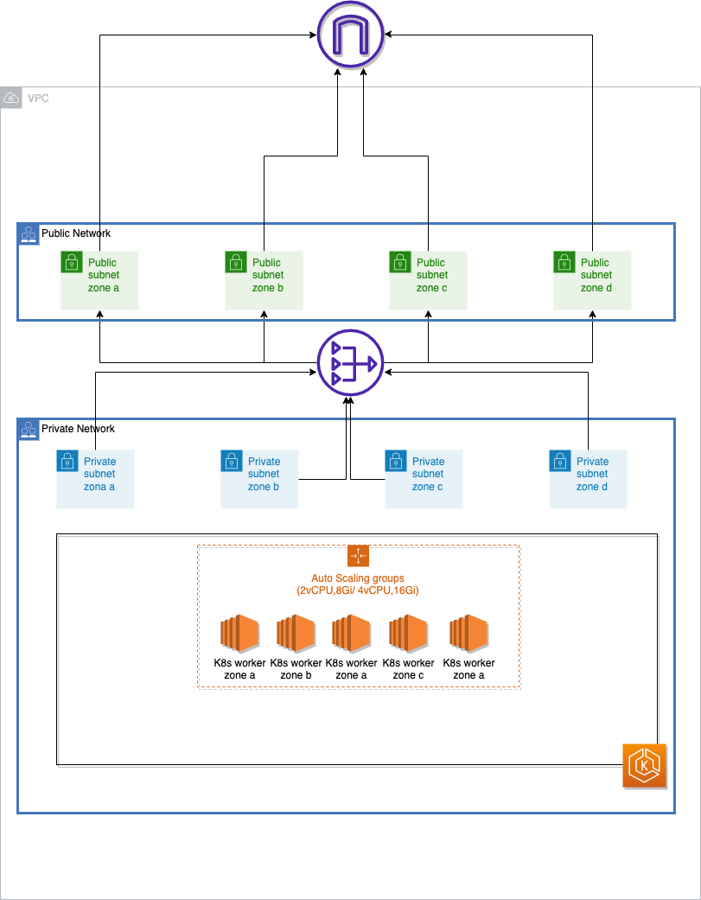

# angi-test-infra
Infrastructure provisioning for Angi's test

Mono repo for managing all of Infra on AWS for delivering Angi's test.

Currently via main.tf, we set up:
- VPC for EKS cluster
- ECR repo for storing images being pushed from [angi-test-app](https://github.com/Mohitsharma44/angi-test-app)
- CI User for pushing images to ECR repo
- EKS cluster with cluster autoscaling

Refer the figure below for (a very rough) architecture

Inside the cluster, we Deploy the following services:
  - certmanager
  - metrics server
  - prometheus
  - amazon supported coredns
  - amazon vpc cni
  - kube proxy
  - nginx ingress controller
  - alb ingress controller
  - argo cd
- Argo CD applications:
  - App of Apps from [angi-test-charts](https://github.com/Mohitsharma44/angi-test-charts) with horizontal pod autoscaling

ToDo: 
- Fix the github actions. Its currently failing when terraform tries to make aws calls (in providers.tf for kubernetes and helm)

> Currently we have a single state file standing up all the resources required for setting up an EKS cluster and running a whole bunch of applications in it.
> Given that we now have over 120 resources being managed in a single statefile, we should break it down into simpler, logical state files for easier and quicker operations
